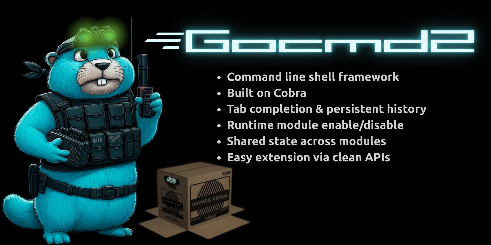

<p align="center">
  
  
  
  <br>
  <a href="https://github.com/Necromancer-Labs"></a>
  <a href="https://github.com/Necromancer-Labs/embbridge"></a>
  <a href="https://necromancer-labs.github.io/gocmd2/"></a>
</p>

# gocmd2

Drop-in interactive shell framework for Go. If you're building a CLI tool that needs a REPL — a debugger, a network tool, a device shell — gocmd2 handles the boring parts so you can focus on your commands.

You get tab completion, command history, module management, and shared state out of the box. Just define your commands with [Cobra](https://github.com/spf13/cobra) and register them.

## Installation

```bash
go get github.com/Necromancer-Labs/gocmd2
```

## Quick Start

```go
package main

import (
	"fmt"
	"os"

	"github.com/Necromancer-Labs/gocmd2/pkg/shell"
)

func main() {
	sh, err := shell.NewShell("myshell", "Welcome!")
	if err != nil {
		fmt.Printf("Error: %v\n", err)
		os.Exit(1)
	}
	defer sh.Close()

	sh.Run()
}
```

That's it. Run it and you get:

```
Welcome!
> help
Available Commands (by module):

[core]
  exit      Exit the shell
  modules   List all modules
  enable    Enable a module
  disable   Disable a module
  help      Display this help message

> exit
```

Tab completion, history, `Ctrl+R` search — all wired up automatically.

## Adding Your Own Commands

Implement three methods and you have a module:

```go
type GreetModule struct {
	shell shellapi.ShellAPI
}

func (m *GreetModule) Name() string { return "greet" }

func (m *GreetModule) Initialize(s shellapi.ShellAPI) { m.shell = s }

func (m *GreetModule) GetCommands() []*cobra.Command {
	return []*cobra.Command{
		{
			Use:   "hello [name]",
			Short: "Say hello",
			Run: func(cmd *cobra.Command, args []string) {
				name := "World"
				if len(args) > 0 {
					name = args[0]
				}
				fmt.Printf("Hello, %s!\n", name)
			},
		},
	}
}
```

Register it and your command is live:

```go
sh.RegisterModule(&GreetModule{})
sh.Run()
```

```
> hello
Hello, World!
> hello Hacker
Hello, Hacker!
```

See the [full module guide](https://necromancer-labs.github.io/gocmd2/modules.md) for shared state, dynamic prompts, and more.

## What You Get For Free

- **Tab completion** for all registered commands
- **Command history** that persists between sessions
- **Module system** — enable/disable command groups at runtime
- **Shared state** — thread-safe key/value store across modules
- **Exit handlers** — cleanup on `exit` or `Ctrl+D`
- **Shell-like parsing** — quoted strings, escaped characters

## Running the Example

```bash
git clone https://github.com/Necromancer-Labs/gocmd2.git
cd gocmd2
go run examples/simple/main.go
```

```
Welcome to the Timer Example!
> time
Shell running for 5s
(5s) > reset
Timer reset!
> modules
  core   [enabled]
  timer  [enabled]
> disable timer
> enable timer
> exit
Goodbye!
```

## Documentation

Full docs at **[necromancer-labs.github.io/gocmd2](https://necromancer-labs.github.io/gocmd2/)**

- [Quick Start](https://necromancer-labs.github.io/gocmd2/quickstart.md) — Get running fast
- [Modules](https://necromancer-labs.github.io/gocmd2/modules.md) — Build command modules
- [Shell API](https://necromancer-labs.github.io/gocmd2/shell-api.md) — Full API reference
- [Core Commands](https://necromancer-labs.github.io/gocmd2/core-commands.md) — Built-in commands
- [Examples](https://necromancer-labs.github.io/gocmd2/examples.md) — Code examples

## License

Refer to the LICENSE file for details.
